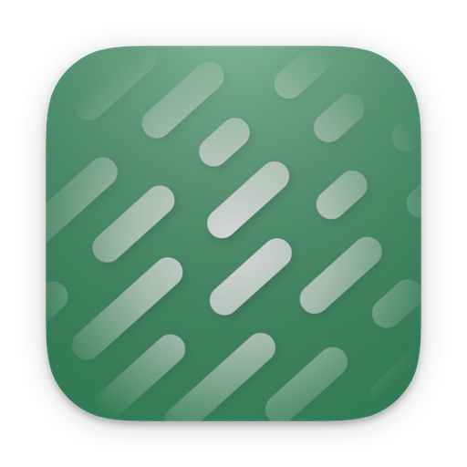
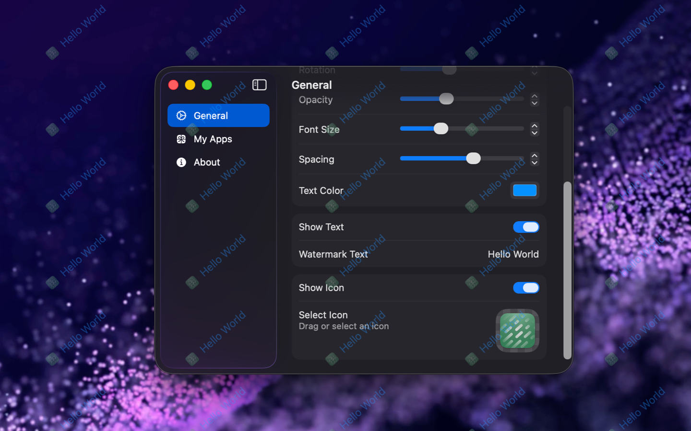
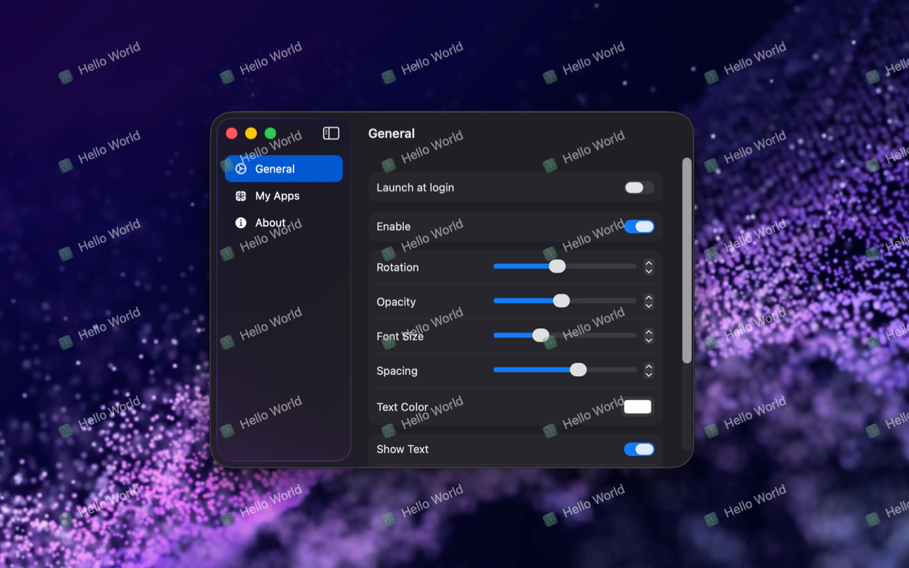

<!--idoc:ignore:start-->
> [!TIP]
> 声明：此项目并非开源项目，仓库作为官方网站，用于收集问题和用户需求。这样做是为了节省成本，因为没有官网，应用无法通过审核。
<!--idoc:ignore:end-->

   
   
  
  <h1>
    Deskmark
  </h1>
  <!--rehype:style=border: 0;-->
  

    <a href="./README.md">English</a> • 
    <a target="_blank" href="https://github.com/jaywcjlove/deskmark/issues/new?template=bug_report_cn.yml">联系&支持</a> • 
    <a href="./CHANGELOG.zh.md">更新日志</a>
  

  

    
  

Deskmark 是一款原生 macOS 应用，可在桌面上添加文本和图标水印，方便在录制视频时使用。你可以将图片和文本水印平铺在桌面上，并自由调整角度、文本大小、图标、平铺间距以及文本颜色，实现个性化的水印效果。

<!--idoc:config:
title: Deskmark
keywords: Deskmark,桌面水印,文本水印,图标水印,视频录制水印,macOS 应用,屏幕水印,桌面工具
description: 一款原生应用，用于在桌面上添加文本和图标水印，方便在录制视频时使用。
-->